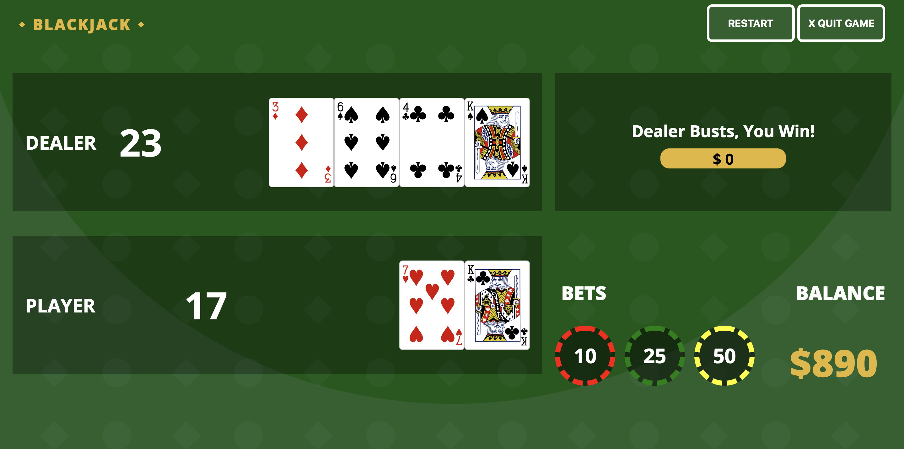

# Blackjack Card Game

* The goal of the game is to beat the dealer's hand by getting a "blackjack"or beat the dealer's total sum of cards.
* Blackjack - cards that total 21.
* Bust - when you go over 21.
* Ace card can count as 1 or 11.
* Face cards - (J, Q, K) count as 10.
* Values of 2 through 10 count as their respective numbers.
* Count of deck is set to 52 to be able to practice counting cards.
* Winning a round pays 1:1
* Buttons:
    * Deal - deals the cards to the dealer and player. 
    * Hit - allows the player to receive one extra card
    * Stand - tells the dealer to play their cards and compare.
    * Double - double your initial bet and receive only one more card.

## User stores:
* User sees popup page with start button .
* User must be able to press start button to show gameboard.
* User sees gameboard.
    * Initial page must have no cards on the table. 
    * Announcement has "Good Luck!" message.
    * Chips must be chosen before deal button is activated.
    * Hit, Stand, and Double buttons become visible after pressing Deal.  
    * Balance is set to $1000.   
* User must be able to select either 10, 25, or 50 chip values multiple times.
* User must be able to press Hold, Hit, or Double buttons. 
* User must be able to press reset  button to restart game without reloading the page.
* User must be able to quit game to reload the page with the modal view.  

## Technologies
* HTML 
* CSS
* Vanilla JavaScript
* CSS library for card SVGs

## Link to Deployed
[Deployed Game](https://helloryantg.github.io/blackjack-game/)

### Unsolved Issues
* Deal button continues to work and renders more cards even after results screen has been rendered.
* Double function has not been added - will be added in future update!
* Add reset button that resets currentBet in case user doesn't want to be that much.
* Issues with deal button staying on screen at different stages
* CSS styling issues - not responsive