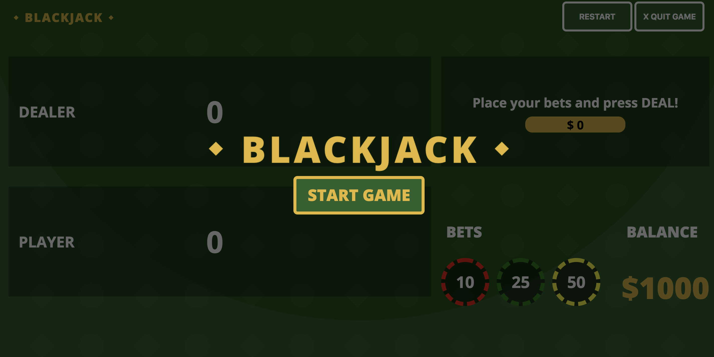
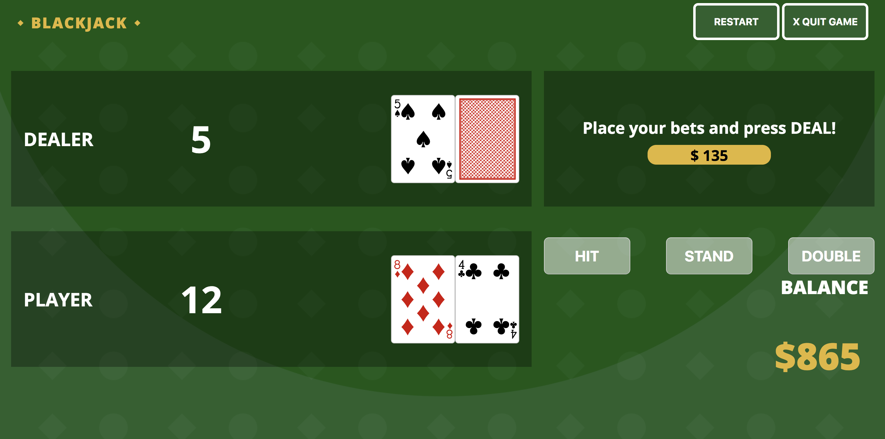

# Blackjack Card Game

* The goal of the game is to beat the dealer's hand by getting a "blackjack"or beat the dealer's total sum of cards.
* Blackjack - cards that total 21.
* Bust - when you go over 21.
* Ace card can count as 1 or 11.
* Face cards - (J, Q, K) count as 10.
* Values of 2 through 10 count as their respective numbers.
* Count of deck is set to 52, but automatically shuffles once remaining cards reach 20.
* Winning a round pays 1:1
* Winning a double hand pays 1:3
* Buttons:
    * __DEAL__ - deals the cards to the dealer and player. 
    * __HIT__ - allows the player to receive one extra card
    * __STAND__ - tells the dealer to play their cards and compare.
    * __DOUBLE__ - double your initial bet and receive only one more card.

## User stores:
* User sees modal page with start button .
* User must be able to press start button to show gameboard.
* User sees gameboard.
    * Initial page must have no cards on the table. 
    * Announcement has "Good Luck!" message.
    * Chips must be chosen before deal button is activated.
    * __HIT__, __STAND__, and __DOUBLE__ buttons become visible after pressing Deal.  
    * Balance is set to $1000.   
* User must be able to select either _10_, _25_, or _50_ chip values multiple times.
* User must be able to press __HIT__, __STAND__, or __DOUBLE__ buttons. 
* User must be able to press __RESET__  button to restart game without reloading the page.
* User must be able to press __QUIT__ button to reload the page with the modal view.  

## Technologies
* HTML 
* CSS
* JavaScript
* CSS library for card SVGs

## Getting Started
[Deployed Game](https://helloryantg.github.io/blackjack-game/)

### Next Steps
* Add BET RESET button that resets current bet amount.
* CSS Styling issues - would like to make game playable in mobile.
* Audio for card fliping and background music.

